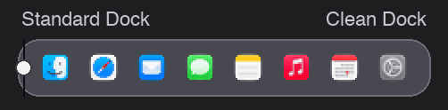

# Clean Dock

<p align="center">
  
</p>

I use a 34" ultrawide that isn't Retina, and I keep my Dock small. At that size the Dock icons
look terrible. Ragged edges, smeared details, the Spotify logo is three broken lines. I assumed a
macOS update would fix it at some point. It didn't, so I made this.

The animation above is actual size, so it is small. Left of the divider is what the Dock draws,
right of it is what Clean Dock draws. If you are on a Retina screen you will see less of a
difference than I do, which is sort of the point: on Retina the Dock is fine and you don't need this.

## Why the Dock looks bad

For a small icon the Dock takes the 128 px version of the app icon and shrinks it with plain bilinear 
sampling. At 17 px that means it looks at roughly 4 pixels out of every 56 and throws the rest away. 
Thin lines survive or vanish depending on where they happen to fall. Clearing icon caches doesn't 
help and there is no setting for it.

Clean Dock doesn't touch the Dock. It reads where each icon sits, shrinks the full-size icon
properly, and draws that copy on top of the blurry one in a window that ignores clicks. Everything
you click, drag or right-click is still the real Dock. When the Dock animates, the sharp icons
move along with it.

## Install

Grab `CleanDock.zip` from the [releases page](https://github.com/thken3/CleanDock/releases), unzip
it, and drag the app to Applications.

If you'd rather build it yourself:

```
git clone https://github.com/thken3/CleanDock.git
cd CleanDock
make app
open build/CleanDock.app
```

## What it asks for

Accessibility is the one permission it can't work without. That is how it finds out where the Dock
icons are. It doesn't read your screen or your keystrokes, it has no network code at all, and you
can check that in the source.

Two more prompts may show up, and you can say no to both. One is for controlling Finder, which is
only used to ask whether the Trash is empty so the right Trash icon gets drawn. The other is for
folders you keep in the Dock as a stack, like Downloads, because drawing the stack means knowing
what's in it. If you decline, those icons just stay the way the Dock draws them.

## Things it doesn't do

It only switches on when the Dock is at the bottom of a non-Retina display. Dock on the left or
right isn't supported yet. On a Retina display it sits idle.

Minimized windows keep their normal look, since those are live thumbnails. So do icons while the
Dock's magnification is blowing them up, and an icon while you're dragging it. Badges and the
little running dots are left alone too.

I've only tested it on my own setup: macOS 27, one 3440×1440 monitor next to a MacBook. It should
work on any non-Retina monitor from macOS 14 up, but if it doesn't on yours, please open an issue
and tell me what you have.

MIT licensed.
